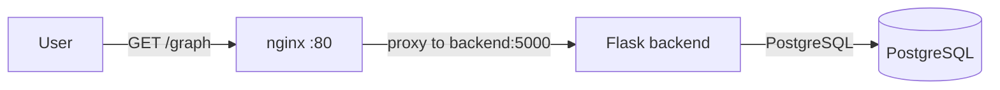
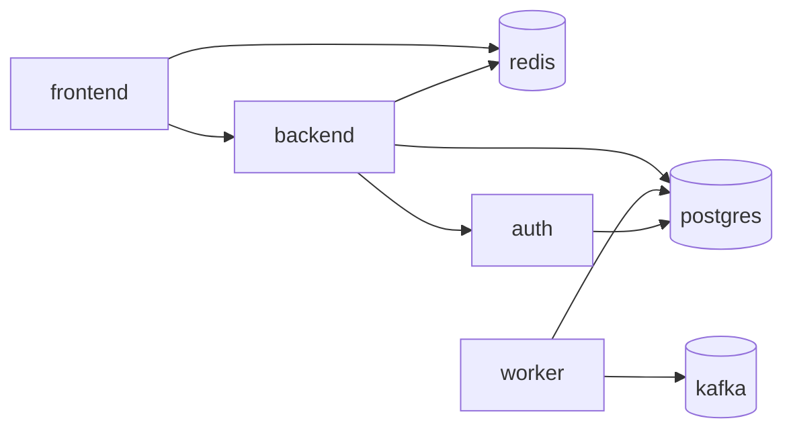

# Scenario 1 — service-catalog

## Result

`curl http://localhost/graph` now returns HTTP `200`. The response contains the
seeded dependency catalog: 7 nodes and 8 edges.



## Problem 1: The stack was not running

### What was wrong

- No process was listening on port 80; `curl http://localhost/graph` failed to
  connect.
- Docker was running, but no service-catalog containers existed and neither
  `docker compose` nor `docker-compose` was installed.
- Installing Compose initially failed because `systemd-resolved` was stopped
  and `/etc/resolv.conf` pointed to `127.0.0.1`, while the resolver listens on
  `127.0.0.53`.

### How I fixed it

1. Enabled and started `systemd-resolved`.
2. Linked `/etc/resolv.conf` to `/run/systemd/resolve/resolv.conf`, the
   resolver's generated uplink-DNS file.
3. Installed `docker-compose` (1.29.2) and validated the Compose file.
4. Started nginx, backend, and PostgreSQL with `docker-compose up -d --build`.
5. Removed one stale, exited backend container whose old image no longer
   existed; PostgreSQL and its data volume were left intact.

### Config I changed (only the changed parts)

`/etc/resolv.conf`

```text
/run/systemd/resolve/resolv.conf
```

### Commands I used

```bash
curl -sS -o /tmp/graph.initial.body -w '%{http_code}' http://localhost/graph
find /opt/service-catalog -maxdepth 3 -type f
docker ps -a
ss -ltnp
systemctl list-units --type=service --all

systemctl enable --now systemd-resolved
ln -sfn /run/systemd/resolve/resolv.conf /etc/resolv.conf
apt-get update
apt-get install -y docker-compose

cd /opt/service-catalog
docker-compose config -q
docker-compose up -d --build
docker ps -aq --filter 'name=service-catalog_backend_1'
docker rm -f <stale-backend-container-id>
docker-compose up -d --no-build
docker-compose ps
curl -sS -o /tmp/service-catalog-graph.json -w '%{http_code}' http://localhost/graph
curl -fsS http://localhost/graph/mermaid
```

## Problem 2: nginx used a nonexistent backend target

### What was wrong

The Compose service is named `backend` and Gunicorn listens on port `5000`, but
nginx was configured to proxy to `backend-api:8080`. That hostname and port do
not exist in this deployment.

### How I fixed it

I changed the nginx upstream to `http://backend:5000`.

### Config I changed (only the changed part)

```nginx
set $backend_upstream http://backend:5000;
```

## Problem 3: The backend could not reach PostgreSQL

### What was wrong

`backend` was attached only to `nginx-backend-net`, while PostgreSQL was
attached only to `backend-db-net`. The backend therefore could not resolve or
connect to the `db` service named in `DATABASE_URL`.

### How I fixed it

I attached `backend` to both networks. nginx remains isolated from the
database network.

### Config I changed (only the changed part)

`docker-compose.yml`

```yaml
backend:
  networks:
    - nginx-backend-net
    - backend-db-net
```

## Verified catalog graph

`GET /graph` returns JSON; `GET /graph/mermaid` returns the Mermaid text below.
In this catalog, `A --> B` means **A depends on B**. Cylinder nodes (`[(name)]`)
are infrastructure dependencies; rectangular nodes are services.



Verification:

```text
HTTP status: 200
Nodes: frontend, backend, worker, auth, postgres, redis, kafka
Edges: 8
Running containers: nginx, backend, db
```

# Extra problems

No extra problems encountered.

