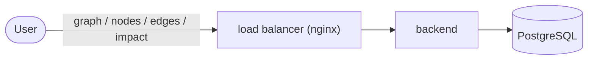

# DevOps Exam

This exam has 2 parts. Keep answers short.
English is better. Persian is OK.
You can use AI. Read your text once before you push.

## Start

1. Open [https://auth.fanap.kubelog.ir](https://auth.fanap.kubelog.ir)
2. Enter the last 4 digits of your phone number.
3. Run the setup commands on that page.
4. First SSH = Scenario 1. Second SSH = Scenario 2.

## Submit

1. Fork [https://github.com/fanapcampus/exam-template](https://github.com/fanapcampus/exam-template)
2. Keep the name `exam-template`. Make it public.
3. Send your public fork URL in [this form](https://docs.google.com/forms/d/e/1FAIpQLSd2tC9HDaLtJpzJGOU3seGmcdvb_liu8d9cHVXwOxGM8aeOvg/viewform) before **19:00**.
4. Work only on these branches:
  - `doc-1` — Scenario 1 write-up (`README.md`)
  - `scenario-2` — Ansible code
  - `doc-2` — Scenario 2 write-up (`README.md`)
5. Do not commit after **19:00**.


## Scenario 1

Someone tried to run [service-catalog](https://github.com/fanapcampus/service-catalog) on the first VM and could not.
Files are in `/opt/service-catalog`. Read the files. Use this picture.




When it works:

```bash
curl http://localhost/graph
```

You need HTTP 200 and the proper output.

Write what you did on branch `doc-1`.

## Scenario 2

On the second VM (or Vagrant), use Ansible to install:

- Prometheus on 9090
- Grafana on 3000
- node_exporter
- Grafana datasource = Prometheus
- one dashboard with CPU and memory

Start from branch `scenario-2`. Do not change the `inventory/` folder.
Put the user and IP in inventory.

I will run:

```bash
python -m venv .venv
source .venv/bin/activate
pip install -r requirements.txt
ansible-playbook -i inventory main.yml -b --private-key ~/.ssh/id_ed25519_fanap
```

The code must run.

Write the doc on branch `doc-2`. Put Grafana user and password there.

## Score

Scenario 1: find 30% · fix 40% · write-up 30%. Find and fix matters most.

Scenario 2: working code 50% · write-up 50%.
If the code does not run, I only look at the doc quickly.