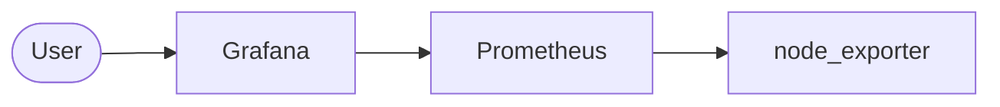

# Scenario 2

Draw the **output** system. You can use AI.
Then explain your code. English is better. Persian is OK.

## Architecture

Replace this picture with your real design.

## Code

### Playbook

### Role: prometheus

### Role: grafana

### Role: node_exporter

### Inventory

## Login

Grafana user:

Grafana password:

# Challenges

Write one item for each challenge. What broke, and how you fixed it.

-
