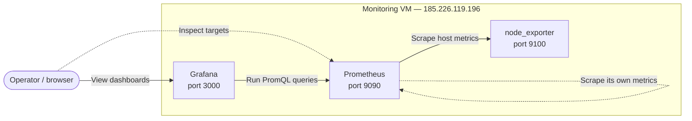

# Scenario 2 — Monitoring with Ansible

This scenario deploys a monitoring stack to the second assigned VM,
`185.226.119.196`. Ansible installs Prometheus, Grafana, and node_exporter;
connects Grafana to Prometheus; provisions a CPU and memory dashboard; and
checks that all three services are healthy.

## Architecture



Prometheus scrapes its own metrics from port 9090 and host metrics from
node_exporter on port 9100 every 15 seconds. Grafana runs on port 3000 and
queries Prometheus through its provisioned datasource. The operator views the
CPU and memory panels in Grafana and can inspect scrape-target health directly
in Prometheus.

## Code

### Playbook & Roles

The entry point is `main.yml`. It contains two plays:

1. **Check SSH connection**
   - Targets the `all` host group.
   - Disables fact gathering so connectivity is checked immediately.
   - Runs `ansible.builtin.ping` once and assigns it the `always` tag.

2. **Deploy monitoring stack**
   - Targets the `monitoring` host group.
   - Enables privilege escalation with `become: true`.
   - Gathers the host facts required by the package tasks.
   - Applies the single combined `monitoring` role.

The `monitoring` role performs the deployment in this order:

1. Refreshes APT metadata and installs `prometheus`,
   `prometheus-node-exporter`, and the required CA certificates.
2. Creates the APT keyring directory, installs Grafana's versioned public
   signing key from the role, and configures Grafana's signed APT repository.
3. Installs Grafana and configures it to listen on `0.0.0.0:3000`.
4. Renders `/etc/prometheus/prometheus.yml`. Before replacing the active file,
   Ansible validates the generated configuration with `promtool check config`.
5. Provisions a Grafana datasource named **Prometheus**, using the stable UID
   `prometheus` and the internal URL `http://127.0.0.1:9090`.
6. Provisions the **System** dashboard folder and the read-only
   **Node CPU and Memory** dashboard.
7. Enables and starts `prometheus`, `prometheus-node-exporter`, and
   `grafana-server` through systemd.
8. Applies any queued handlers and validates the three listening ports and
   HTTP health endpoints.

The role is intentionally idempotent. Package tasks use `state: present`,
service tasks use `state: started` with `enabled: true`, and Ansible rewrites
managed files only when their content changes. Prometheus and Grafana restart
through handlers only after a relevant configuration or provisioning file has
changed.

The role consists of the following files:

| File | Purpose |
| --- | --- |
| `roles/monitoring/tasks/main.yml` | Installation, configuration, service management, and health checks |
| `roles/monitoring/handlers/main.yml` | Conditional Prometheus and Grafana restarts |
| `roles/monitoring/templates/prometheus.yml.j2` | Prometheus self-scrape and node_exporter scrape configuration |
| `roles/monitoring/templates/prometheus-datasource.yml.j2` | Grafana Prometheus datasource provisioning |
| `roles/monitoring/files/grafana.asc` | Grafana's public APT repository signing key |
| `roles/monitoring/files/dashboard-provider.yml` | Grafana file-based dashboard provider |
| `roles/monitoring/files/node-cpu-memory.json` | CPU and memory panels, layout, and PromQL expressions |

The dashboard contains two time-series panels:

- **CPU usage** calculates the percentage of non-idle CPU time from
  `node_cpu_seconds_total`.
- **Memory usage** calculates used memory from
  `node_memory_MemAvailable_bytes` and `node_memory_MemTotal_bytes`.

### Inventory

The required `inventory/` directory structure was preserved:

```text
inventory/
├── group_vars/
│   ├── all.yml
│   └── monitoring.yml
└── inventory/
    ├── all.yml
    └── monitoring.yml
```

The files have these responsibilities:

- `inventory/inventory/all.yml` declares `monitoring` as a child group of
  `all`.
- `inventory/inventory/monitoring.yml` defines the `mon-1` host with
  `ansible_host: 185.226.119.196` and `ansible_user: root`, exactly where the
  scenario instructions require them.
- `inventory/group_vars/all.yml` selects `/usr/bin/python3` as the remote
  Python interpreter.
- `inventory/group_vars/monitoring.yml` defines the Prometheus, Grafana, and
  node_exporter ports as well as the Grafana APT repository value.

No inventory directories or files were added, removed, renamed, or moved.

## Deployment

Run the deployment from the repository root on a Linux control node. On a
Windows computer, use WSL because Ansible does not support a native Windows
control node. The assigned private SSH key must be present locally at
`~/.ssh/id_ed25519_fanap`; the key itself must never be committed.

```bash
python -m venv .venv
source .venv/bin/activate
pip install -r requirements.txt
ansible-playbook -i inventory main.yml -b --private-key ~/.ssh/id_ed25519_fanap
```

## Validation

The playbook performs automated validation after configuration:

- Prometheus and node_exporter may take up to 30 seconds to open their ports.
- Grafana may take up to 90 seconds because its first startup can include
  database migrations and plugin initialization.
- Prometheus must return HTTP 200 from `/-/ready`.
- Grafana must return HTTP 200 from `/api/health`.
- node_exporter must return HTTP 200 from `/metrics`.

The deployed services can also be checked manually over SSH:

```bash
systemctl is-active prometheus grafana-server prometheus-node-exporter

curl http://127.0.0.1:9090/-/ready
curl http://127.0.0.1:3000/api/health
curl http://127.0.0.1:9100/metrics | grep node_memory_MemTotal_bytes
```

All three services should report `active`. Prometheus should report
`Prometheus Server is Ready`, Grafana should report `"database": "ok"`, and
node_exporter should return the host's total-memory metric.

The web interfaces are available at:

- Grafana: `http://185.226.119.196:3000`
- Prometheus targets: `http://185.226.119.196:9090/classic/targets`

In Grafana, open **Dashboards → System → Node CPU and Memory**. On the
Prometheus targets page, both `prometheus` and `node_exporter` should be
**UP**. The validated second playbook run completed with `failed=0` and
`changed=0`, confirming idempotency.

## Grafana login

```text
user: admin
pass: We8vnkzREsQEi4s
```

## Challenges

- **Native Windows execution**: Ansible failed when started from a native
  Windows Python virtual environment because Windows does not provide the
  POSIX APIs required by Ansible. Running it from Linux or WSL resolves the
  problem.
- **Pinned Ansible and remote Python compatibility**: The pinned
  `ansible-core` 2.14 `get_url` module used an HTTPS argument removed in Python
  3.12. The role now installs Grafana's public signing key from a versioned
  role file, avoiding the incompatible HTTPS code path.
- **PyPI connectivity from the VM**: The VM could reach Ubuntu package mirrors,
  but its PyPI requests timed out. Ubuntu's Ansible package was used for the
  VM-side validation run.
- **Grafana's first startup**: Grafana needed more than 30 seconds to initialize
  on its first launch. Its dedicated readiness timeout was increased to 90
  seconds.
- **Prometheus targets page**: `/targets` returns HTTP 404 on the installed
  Ubuntu package build. The working page is `/classic/targets`.
- **Repeatable Grafana configuration**: The datasource and dashboard are
  delivered through provisioning files rather than one-time API requests, so
  repeated deployments remain consistent.
